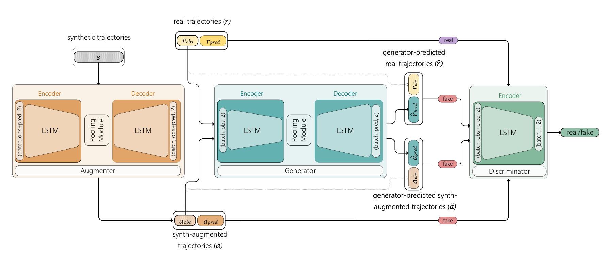

# AA-SGAN: Adversarially Augmented Social GAN with synthetic data

A new implementation of [SGAN](https://arxiv.org/abs/1803.10892) that exploits both real trajectories and synthetic trajectories obtained from [JTA Dataset](https://aimagelab.ing.unimore.it/imagelab/page.asp?IdPage=25)

This is the code for the paper:

**<a href="https://arxiv.org/abs/2412.18038">AA-SGAN: Adversarially Augmented Social GAN with Synthetic Data</a>** 
  
<a href="https://www.linkedin.com/in/mirkozaff/">Mirko Zaffaroni</a>, 
<a href="https://www.linkedin.com/in/federico-signoretta-46a387160/">Federico Signoretta</a>, 
<a href="https://eidos.di.unito.it/author/marco-grangetto/">Marco Grangetto</a>, 
<a href="https://eidos.di.unito.it/author/attilio-fiandrotti/">Attilio Fiandrotti</a> 
  
Presented at [ROAD++ @ ECCV2024](https://sites.google.com/view/road-eccv2024/)

Accurately predicting pedestrian trajectories is crucial in applications such as autonomous driving or service robotics, to name a few. Deep generative models achieve top performance in this task, assuming enough labelled trajectories are available for training. To this end, large amounts of synthetically generated, labelled trajectories exist (e.g., generated by video games). However, such trajectories are not meant to represent pedestrian motion realistically and are ineffective at training a predictive model. We propose a method and an architecture to augment synthetic trajectories at training time and with an adversarial approach. We show that trajectory augmentation at training time unleashes significant gains when a state-of-the-art generative model is evaluated over real-world trajectories.

## Model
Our model consists of three key components: Agumenter (A), Generator (G), and Discriminator (D). The Augmenter learns to augment synthetic trajectories into synth-augmented; the Generator learns to
generate trajectories prediction; the Discriminator learns to discriminate real from generated and synth-augmented trajectories.

  

## Aknowledgement
This code borrows from:

**<a href="https://arxiv.org/abs/1803.10892">Social GAN: Socially Acceptable Trajectories with Generative Adversarial Networks</a>**
 
<a href="http://web.stanford.edu/~agrim/">Agrim Gupta</a>,
<a href="http://cs.stanford.edu/people/jcjohns/">Justin Johnson</a>,
<a href="http://vision.stanford.edu/feifeili/">Fei-Fei Li</a>,
<a href="http://cvgl.stanford.edu/silvio/">Silvio Savarese</a>,
<a href="http://web.stanford.edu/~alahi/">Alexandre Alahi</a>
 
Presented at [CVPR 2018](http://cvpr2018.thecvf.com/)
